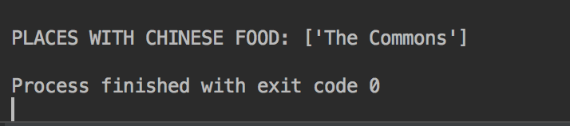
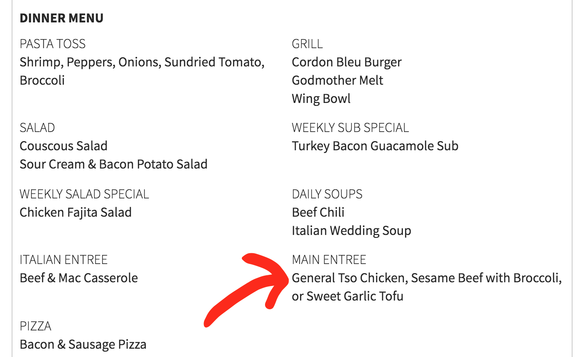

# Chinese Food Finder
### Background Information

As a human being, I love eating food. When I came to RIT it was extremely difficult to find Chinese food on campus. I would have to search through nearly 20 web pages and ctrl+f for the phrase 'Chinese food' just to see if anywhere was serving it for the day.

This program solves that issue and searches ALL RIT dining locations for Chinese food, displaying where it's being served at.

## We Found Chinese Food!
On the rare occasion of RIT having Chinese food, I present to you:

## How it Works
1) Running the program will begin collecting URL links for each individual dining location from https://www.rit.edu/fa/diningservices/places-to-eat/hours.

2) Each individual link is then analyzed, building an array of menu items and searching each item to check if it is Chinese food.

There are 21 currently searched dining locations by Chinese Food RIT.

## Running the Program
Built using Python 3.

Running the program in terminal:
python3 chinese.py

## Future Plans
This project could be changed to search for specific food on campus other than Chinese food. At the moment, I plan to implement a cleaner HTML parsing for the websites rather than splitting with tags. Eventually, I will have push notifications to my phone when I see general tso's.

Overall, I'm very excited to find Chinese food on campus.
